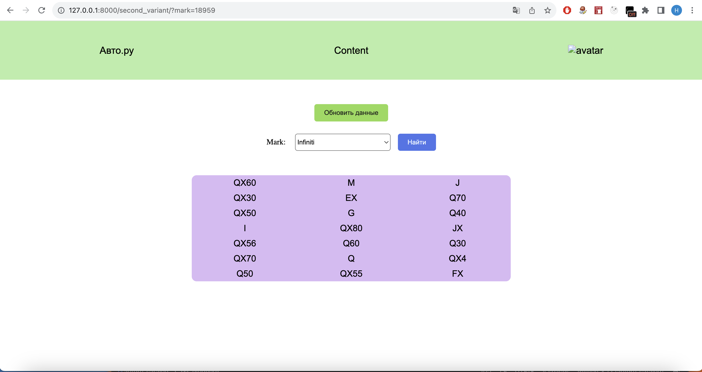

## Каталог Авто.ру

### Приложение для парсинга XML-файла и сохранения данных в базу данных.

____
### Главная страница




При первом запуске приложения база данных уже заполнена, поэтому вы увидите все модели всех марок. Если нажать кнопку обновить данные, 
xml файл удалится, БД очистится, новый файл скачается, распарсится и запишется в БД и снова можно пользоваться поиском.

### Ссылка на видео

https://disk.yandex.ru/i/cfJL4wDuRXlW1g

____

### Установка и запуск приложения


```
git clone https://github.com/molodcovnik/autoru_catalog.git
cd autoru_catalog
python3 -m venv venv
source venv/bin/activate
pip install -r requirements.txt
cd catalog
python manage.py  runserver

```
